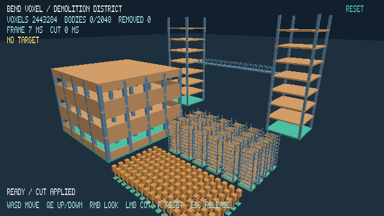

# Bend Voxel

An interactive destructible voxel district built with [Bend 2](https://github.com/bendlang/bend) and a native Vulkan renderer. Explore two towers connected by a severable bridge, a windowed production hall, machinery racks, and a field of supported blocks. Voxel storage, connectivity, carving, picking, and motion run in Bend on the CPU. CUDA is not required.



One district contains **2,443,284 editable 10 cm voxels** in a **64 × 64 × 32 meter** content envelope. Launch 4 or 16 districts to reach **9,773,136** or **39,092,544** occupied cells. Worlds use signed coordinates and sparse storage; the old fixed lattice is removed.

## Quick start

You need **[Bend 2.0.27](https://github.com/bendlang/bend/releases/tag/v2.0.27)**, Linux with X11 or XWayland, a Vulkan 1.3 graphics driver with Xlib surface support, Vulkan and X11 development headers, `glslc`, `g++`, and `make`. The benchmark also needs Python 3. Check that `bend version` prints `bend 2.0.27`; the build does not install or update Bend.

```sh
make run
```

This compiles the shaders, native Vulkan library, and Bend application, then opens a resizable window with a 640 × 360 logical view. To build once and launch separately:

```sh
make build
./scripts/run.sh
```

## Controls

| Input | Action |
| --- | --- |
| Pointer | Aim; yellow cells show the removal preview |
| Left click | One 20 cm radius spherical cut |
| Hold right mouse + drag | Look; carving is disabled while looking |
| W / A / S / D | Move horizontally |
| Q / E | Move down / up |
| R or RESET | Restore the scene and camera |
| Escape | Release controls; click the scene to resume |

Green material marks protected anchors; concrete is tan, frames are blue, machinery and bridge fuses are orange, and detached geometry is purple. The floor is indestructible. Bodies fall vertically and stop at the floor. Rotation, body collisions, stacking, and reattachment are not implemented. The camera travels at 12 m/s without collision or horizontal bounds.

```sh
VOXEL_DISTRICTS=4 ./scripts/run.sh
VOXEL_DISTRICTS=16 VOXEL_BODY_BUDGET=4096 ./scripts/run.sh
```

`VOXEL_DISTRICTS` accepts 1, 4, or 16; each adds real material at distinct coordinates. The default detached-body budget is 2,048, configurable up to 65,536. An edit that exceeds the budget is rejected atomically. Reset restores the selected district count and budget.

The bridge is 16 meters above the ground, between the northern towers. Its two orange fuses are near **(−15.9, 16.25, −19.95)** and **(15.9, 16.25, −19.95)** meters. Cut both to detach it, then cut the falling or landed fragment again. The repeatable bridge workload performs the same two edits automatically.

## Verify

```sh
make test
make benchmark-stress
```

The stress suite opens the Vulkan window and measures real scale, camera motion, aim sweeps, cuts across region boundaries, bridge severing, and 128/512 falling bodies. It uses unpaced presentation, records mesh-cache behavior, and saves samples and a report under `build/stress/`. See the [stress benchmark guide](docs/stress-benchmark.md).

## Implementation

- `src/spatial.bend`: sparse solid cuboids, spatial trees, sphere subtraction, shared-face connectivity, and exposed rectangles.
- `src/world.bend`: body ownership, transactional edits, configurable budget, and vertical motion.
- `src/district.bend`: deterministic district generation and real spatial replication.
- `src/render.bend`: camera and spatial picking.
- `src/input.bend`, `src/demo.bend`, `src/main.bend`: controls, HUD, application loop, and repeatable workloads.
- `src/vulkan/`: per-body transport/mesh caches, dirty mesh uploads, transform draws, and Vulkan presentation.
- `src/math.bend`: vector/camera primitives adapted from Bend3D; see the [third-party notice](src/vendor/NOTICE.md).

See the [sparse storage decision](docs/adr/0001-sparse-cuboid-world.md), [world model glossary](CONTEXT.md), and [earlier architecture exploration](docs/architecture.md). Irregular destruction can grow the number of stored regions and surfaces; the suite measures this representation rather than promising an arbitrary-world scale limit.

The original bounded demo and earlier renderer experiments remain documented in the [Vulkan validation archive](docs/vulkan-renderer.md). The project is listed in [Awesome Bend's community demos](https://github.com/777genius/awesome-bend#community-demos). All project documentation is maintained in English.
