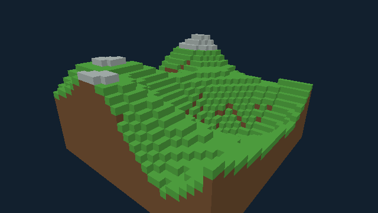

# Voxel Terrain in Bend 2

A native Linux terrain exploration demo backed by a **sparse voxel octree (SVO)**. Fly around stepped hills and valleys with grass, earth, and stone. Terrain editing and destruction physics are outside this demo's scope.



## Run

Requires **Bend 2.0.25**, CUDA (`/opt/cuda` by default) for compilation, and an X11 desktop (including XWayland). CUDA execution additionally requires an NVIDIA GPU.

```sh
make run
```

The demo opens at **640 × 360 on the CPU by default**. To build or launch separately:

```sh
make build
./scripts/run.sh
# Optional CUDA execution:
./scripts/run.sh --gpu on
```

Set `CUDA_HOME` if CUDA is installed elsewhere. The build verifies the pinned compiler and CUDA module. `VOXEL_FRAMES=3 ./scripts/run.sh` exits after three frames for a windowed smoke check.

## Controls

| Input | Action |
| --- | --- |
| Hold right mouse + drag | Look |
| W / A / S / D | Move horizontally |
| Q / E | Move down / up |
| R or RESET | Reset the camera |
| Escape | Release controls; click the scene to resume |

The camera has bounded free flight and no collision. Left click resumes controls and does not modify terrain.

## Implementation and verification

The deterministic 32³ domain spans 6.4 meters per axis at 20 cm resolution. Uniform empty or solid regions collapse into octree leaves. The initial terrain contains **10,139 solid voxels in 4,217 SVO nodes**. Exposed faces are cached from octree lookups and rendered with the existing Bend3D rasterizer. See [terrain implementation and limits](docs/terrain-demo.md).

```sh
make test
```

Tests verify every terrain cell, octree compression, domain boundaries, occupied volume, and surface extraction, alongside the existing table regression suite.

- `src/terrain.bend`: terrain generation, compressed SVO, lookup, surface extraction and drawing.
- `src/demo.bend`: terrain application loop and HUD.
- `src/input.bend`, `src/render.bend`: shared navigation and rendering helpers.
- `src/platform/`: native clock/window adapter and text presentation.

## Legacy destruction prototype

The former destructible table remains in `src/table-demo.bend` for regression checks:

```sh
./scripts/build.sh table-demo
./build/voxel-table-demo --gpu off
```

`make benchmark`, `make snapshots`, and `make compare-backends` retain the **legacy table workload**. Its recorded performance results do not apply to terrain. See [table validation](docs/demo-validation.md), [profiling](docs/profiling.md), and the [historical architecture proposal](docs/architecture.md).

The vendored Bend3D source is unchanged; see [third-party notices](src/vendor/NOTICE.md). Domain terms live in [CONTEXT.md](CONTEXT.md). All project documentation is maintained in English.
