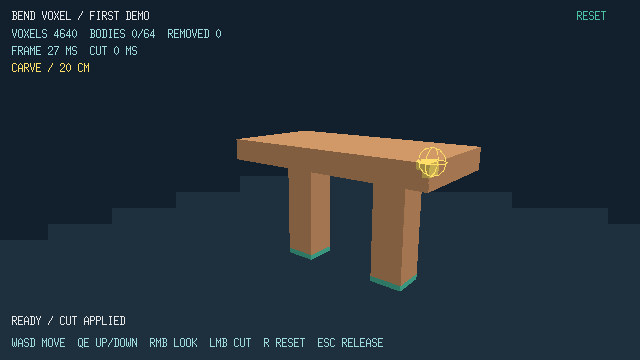

# Voxel Engine in Bend 2

A native Linux demo of small, destructible voxels, implemented in Bend 2. A slab rests on two supports: carve through them to detach the slab, then cut it while falling or after it lands.



## Run

Requires **Bend 2.0.25**, CUDA (`/opt/cuda` by default), an NVIDIA GPU, Python 3 for the benchmark, and an X11 desktop (including XWayland).

```sh
make run
```

This builds and launches at **640 × 360 on the CPU by default**. To build or launch separately:

```sh
make build
./scripts/run.sh
# Opt into CUDA for an interactive run:
./scripts/run.sh --gpu on
```

Set `CUDA_HOME` if CUDA is installed elsewhere. The build checks the compiler version and CUDA module; it does not update Bend automatically. The tested machine is a GTX 1660 / Ryzen 5 1600 Linux desktop.

The interactive CPU default follows the [controlled CPU/CUDA comparison](docs/research/controlled-cpu-cuda.md). Worker count uses the runtime default. `make benchmark` still forces CUDA for acceptance, and `make snapshots` still defaults to CUDA. Launching `build/voxel-demo` directly bypasses the script's CPU default; pass `--gpu off` explicitly for CPU execution.

## Controls

| Input | Action |
| --- | --- |
| Pointer | Aim; yellow cells show the removal preview |
| Left click | One 20 cm radius spherical cut |
| Hold right mouse + drag | Look; carving is disabled while looking |
| W / A / S / D | Move horizontally |
| Q / E | Move down / up |
| R or RESET | Restore the scene and camera |
| Escape | Release controls; click the scene to resume |

Green voxels are protected anchors. Purple geometry is detached. The floor is indestructible. Detached bodies fall vertically and stop on the floor; they do not rotate, collide with each other, or reattach. The camera has bounded movement and no collision.

The scene contains 4,640 ten-centimeter voxels. Connectivity uses shared faces. A cut that would exceed **64 detached bodies, including landed bodies**, is rejected without changing the world.

## Verify

```sh
make test
make benchmark
```

The benchmark takes about 3¼ minutes and opens the native window. It runs the agreed destruction/camera sequence three times, each with a five-second warm-up and sixty-second measurement. Raw samples and the report are saved under `build/benchmarks/`. A failed acceptance gate returns a nonzero exit code. **Current status:** correctness checks pass, but the three-run performance test misses the frame and cut p95 targets. See [validation and results](docs/demo-validation.md).

Stage timings retain every end-to-end sample, including warm-up. Run `make snapshots` for deterministic CUDA-rendered PNGs and world-state dumps. See the [profiling guide](docs/profiling.md) for timing boundaries, CSV fields and snapshot commands.

Run `make compare-backends` for a diagnostic CPU/CUDA thread-count sweep with fixed-clock pixel/state checks and interleaved windowed runs (about 22 minutes). Results go to `build/backend-comparison/`; use a new output directory for each experiment. This does not replace `make benchmark` for forced-CUDA acceptance.


## Implementation

- `src/world.bend`: voxel ownership, carving, connectivity, atomic cap enforcement, vertical motion, cached surface rectangles and rows.
- `src/render.bend`: camera, face picking, clipping, mesh and preview construction; Bend3D CPU/CUDA rasterization.
- `src/input.bend`: controls, movement and focus handling.
- `src/demo.bend`: application loop, HUD content and timed replay.
- `src/platform/`: native clock/window adapter and text presentation.

The vendored [Bend3D source](https://github.com/bendlang/bend/blob/a49524265bdfa5753a4bf38e25f0574a705dd868/demos/app_slash_boss_3d/bend3d.bend) is pinned and unchanged. See [third-party notices](src/vendor/NOTICE.md).

The broader engine design remains exploratory; this demo uses a bounded dense lattice rather than implementing the proposed sparse world:

- [Architecture and implementation sequence](docs/architecture.md)
- [Bend capabilities and CUDA verification](docs/bend-feasibility.md)
- [Demo baseline research](docs/research/demo-baseline.md)
- [Bend ecosystem resources and recommendations](docs/research/bend-ecosystem.md)
- [World model glossary](CONTEXT.md)

All project documentation is maintained in English.
