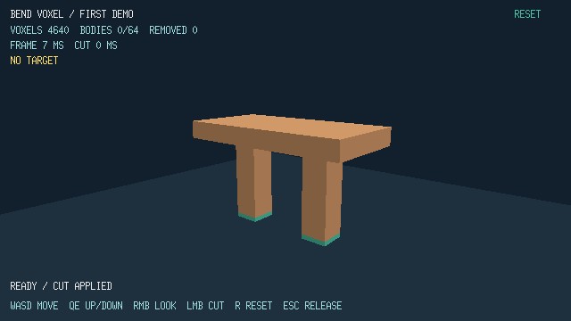

# Voxel Engine in Bend 2

A native Linux demo of small, destructible voxels, implemented in Bend 2 with Vulkan rendering. A slab rests on two supports: carve through them to detach the slab, then cut it while falling or after it lands.



## Run

Requires **Bend 2.0.26**, Linux/X11 or XWayland, a Vulkan 1.3 graphics driver with Xlib surface support, Vulkan and X11 development headers, `glslc`, and `g++`. The benchmark also requires Python 3.

```sh
make run
```

The build compiles the shaders, native Vulkan library, and Bend application. It launches a 640 × 360 logical view. Bend executes gameplay on the CPU; Vulkan draws and presents the scene. CUDA is not required. To build or launch separately:

```sh
make build
./scripts/run.sh
```

The build checks the pinned Bend version and does not update it automatically. The measured machine is a GTX 1660 / Ryzen 5 1600 Linux desktop.

## Controls

| Input | Action |
| --- | --- |
| Pointer | Aim; yellow cells show the removal preview |
| Left click | One 20 cm radius spherical cut |
| Hold right mouse + drag | Look; carving is disabled while looking |
| W / A / S / D | Move horizontally |
| Q / E | Move down / up |
| R or RESET | Restore the scene and camera |
| Escape | Release controls; click the scene to resume |

Green voxels are protected anchors. Purple geometry is detached. The floor is indestructible. Detached bodies fall vertically and stop on the floor; they do not rotate, collide with each other, or reattach. The camera has bounded movement and no collision.

The scene contains 4,640 ten-centimeter voxels. Connectivity uses shared faces. A cut that would exceed **64 detached bodies, including landed bodies**, is rejected without changing the world.

## Verify

```sh
make test
make benchmark
```

The benchmark opens the Vulkan window and runs the agreed destruction and camera sequence three times. Each run has a five-second warm-up and sixty-second measurement. Raw samples and the report are saved under `build/benchmarks/`; a failed acceptance gate returns a nonzero exit code. The [Vulkan validation](docs/vulkan-renderer.md) records three passing runs on the tested desktop. See the [profiling guide](docs/profiling.md) for timing boundaries and CSV fields.

## Implementation

- `src/world.bend`: voxel ownership, carving, connectivity, atomic cap enforcement, vertical motion, and cached surface rectangles.
- `src/render.bend`: camera geometry and face picking used by gameplay.
- `src/input.bend`: controls, movement, and focus handling.
- `src/demo.bend`: gameplay state, HUD content, and timed replay.
- `src/main.bend` and `src/vulkan/`: application loop, native rasterizer, and swapchain.
- `src/math.bend`: vector and camera primitives adapted from Bend3D; see the [third-party notice](src/vendor/NOTICE.md).

The broader engine design remains exploratory; this demo uses a bounded dense lattice rather than implementing the proposed sparse world:

- [Architecture and implementation sequence](docs/architecture.md)
- [Demo baseline research](docs/research/demo-baseline.md)
- [World model glossary](CONTEXT.md)

Earlier CPU/CUDA renderer experiments and measurements remain in `docs/` as historical research. All project documentation is maintained in English.
