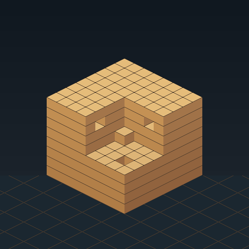

# Bend voxel rewrite

Run one editable 8³ voxel body in a native window. Destroy part of the body and inspect the newly exposed surfaces.



## Run the slice

Use Bend 2.0.34 or newer. Native GPU builds require the compiler and SDK for the available Bend execution lane. On Linux, install `libx11-dev` for the window.

```sh
	make
	make run
```

Use these controls:

- Press **Space** to remove a sphere near the visible front corner.
- Click a visible voxel with the primary mouse button to apply the same sphere brush at that voxel.
- Press **R** to restore the solid body.
- Press **Escape**, or close the window, to exit.

The image uses a fixed isometric camera. The brush removes cells within a radius of three cells. Repeating the same cut leaves the body unchanged.

To run on the CPU, disable GPU dispatch through Bend's runtime option:

```sh
	./build/bend-voxel-rewrite --gpu off
```

To require the available GPU lane, force GPU execution:

```sh
	./build/bend-voxel-rewrite --gpu on
```

Keep `build/bend-voxel-rewrite.gpu` beside the executable. On the development Linux machine, the CUDA SDK is at `/opt/cuda`. The Makefile detects that path at the build boundary. To use a different SDK path, set `CUDA_HOME`:

```sh
	make CUDA_HOME=/path/to/cuda
```

## Verify the slice

Run the formal laws, geometry reference cases, and complete CPU/GPU image comparisons:

```sh
	make test
```

The geometry reference check is written in Bend and compares complete cell and face sets, including materials. Run it separately with `make geometry`. The image checker and its parser and SHA-256 tests are also written in Bend. Run them with `make images`, or run only the parser and hash tests with `make image-unit`. Image checks force both `--gpu off` and `--gpu on` across four tile and fork configurations. `make benchmark-unit` checks benchmark parsing, ordering, report generation, and numeric behavior without opening windows.

To compare images on a machine without a GPU, run the CPU cases:

```sh
	make build/image-checker image-unit
	./build/image-checker --gpu off -- --cpu-only
```

The checker saves exports under `build/image-check`. It resolves the repository from its executable path, so absolute or relative invocations also work from another directory. If you invoke a bare executable name through `PATH`, supply `--root /path/to/repository`. Use `--binary path/to/renderer` to select another renderer. Relative renderer paths resolve under that root.

The parser accepts the renderer's unsigned ASCII P3 format with literal `P3 512 512 255` header tokens and exactly 786,432 channels in 0..255. ASCII whitespace and leading zeros in channels are accepted. PPM comments, signed values, digit underscores, and Unicode digits are rejected.

The native window check uses `Window.export_ref` and `Window.capture` from [the aivv73 Bend fork](https://github.com/aivv73/bend). Input and lifecycle checks use [bend-ui-test](https://github.com/aivv73/bend-ui-test), pinned as the `deps/bend-ui-test` submodule. The tested compiler revision is `de38700481244494b56a2f947df6fba25f798887`. With the fork checked out beside this project, initialize the pinned dependency and run:

```sh
	git submodule update --init --recursive
	make ui UI_BEND='bun ../bend/bend2/main.ts'
	./build/ui-check --gpu off -- --output .audit/screenshots/cpu
	./build/ui-check --gpu on -- --close-method window --output .audit/screenshots/window-close
```

The GPU target saves native PPM screenshots in `.audit/screenshots/ui`. The CPU command saves them in `.audit/screenshots/cpu`.

The native check runs the slice's real view, event reducer, and `App.step`. `Window.capture` reads the owned window's client pixels after earlier output completes. Keep the client fully on-screen and unobscured during the test. `scripts/ui_capture.bend` converts its RGB array to an `Image`; Bend checks the pixels and exports screenshots. The checker passes `WindowRef` directly to `UITest.key`, `UITest.click`, `UITest.request_close`, and `UITest.alive`. The library owns native event delivery and expiry checks. A close request goes through the app reducer, which closes the owned window. The check requires Linux/X11 and `libX11`. Unsupported backends report an error.

`make ui` also runs the pure capture-conversion tests. Run them without opening a window with `make ui-unit UI_BEND='bun ../bend/bend2/main.ts'`.

The library's native effects use Bend runtime internals. To rebuild with a different compiler, run `make -B ui UI_BEND='bun ../bend/bend2/main.ts'`. After checking out a different project revision, run `git submodule update --init --recursive` to select its pinned library version. Read [the verification notes](docs/verification.md) for the tested revisions and the scope of formal proofs and runtime checks.

## Export an image

Write the same rendered `Image` to a deterministic PPM file:

```sh
	./build/bend-voxel-rewrite --gpu on --dump build/full.ppm
	./build/bend-voxel-rewrite --gpu on --cut --dump build/destroyed.ppm
```

## Measure native frames

Measure displayed frames with cached scenes and scripted destruction and reset:

```sh
	make benchmark
```

The Bend command records sequential CPU and GPU measurements in `build/benchmark.json`. Each child opens a native window and excludes eight warm-up frames. CPU thread counts and GPU work decomposition are measured separately. The default CPU counts are one, half the logical system processors, and all logical system processors, with duplicate defaults removed. Override the workload and CPU counts through the built benchmark:

```sh
	./build/benchmark --gpu off -- --frames 120 --repeats 3 --cpu-threads 1 4 8
```

Samples measure elapsed integer milliseconds divided by measured frames, in ms/frame, with 53-bit binary precision. The median selects the middle sample for an odd count and averages the two middle samples for an even count. Progress rounds the stored sample to exactly three fractional digits with ties to even. Report numbers retain the full stored precision. Repeated thread entries run repeated measurements and share one report row. Each alternate repeat reverses the complete configuration list.

Numeric arguments accept unsigned ASCII decimal integers, including leading zeros. Frames must be in 24..4294967295, repeats in 2..4294967295, and thread counts in 1..4294967295. Options accept `--flag=value`; later occurrences replace earlier values. `--cpu-threads` accepts one or more counts. Use `--output path/to/report.json` to select a report path relative to your current directory.

The benchmark resolves its repository from the canonical executable or script path, including a bare executable found through `PATH`. `--root /path/to/repository` selects another root. `--binary path/to/renderer` accepts an absolute path or a path under that root. Child processes run in the repository directory. The host helpers require POSIX `sh`, `getconf`, and GNU `realpath`, `dirname`, `date`, and `mkdir`; the current GNU/Linux host is verified. Read [the measurement contract and limits](docs/verification.md#native-measurement).

To choose a work decomposition, set both depths:

```sh
	./build/bend-voxel-rewrite --gpu on --tile-depth 5 --fork-depth 5 --bench 120
```

The default tile and fork depths are both five. Native measurements selected that configuration for the available GPU lane.

`--tile-depth` chooses the tile tree depth within the 512-pixel image. `--fork-depth` chooses how many tile tree levels may fork. Both accept values from zero to nine. Leaves run sequentially. These settings change scheduling and candidate lists while preserving the pixels.

Read [the design notes](docs/design.md) for the data flow, boundaries, and examples considered.
