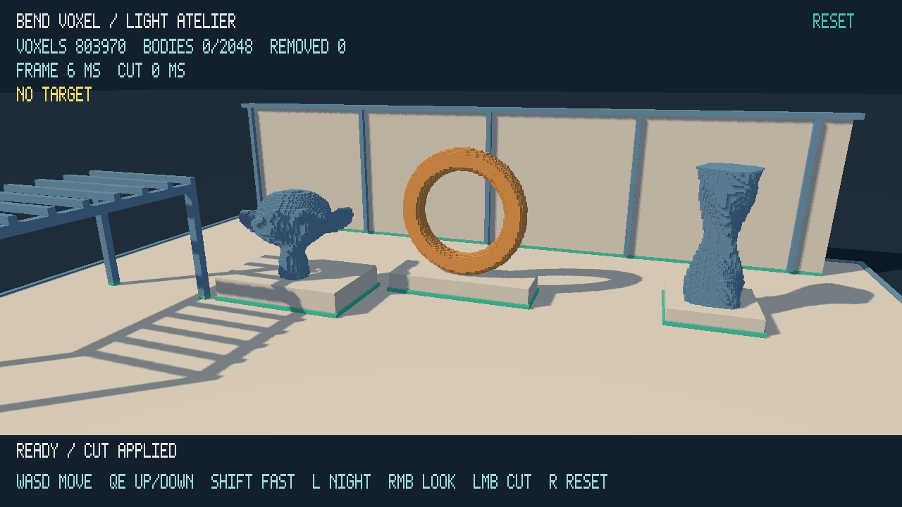

# Bend Voxel

A destructible voxel demo built with [Bend 2](https://github.com/bendlang/bend) and a native Vulkan renderer. Explore and carve three sculptures in **Light Atelier**.



## Run

Requires [Bend 2.0.32](https://github.com/bendlang/bend/releases/tag/v2.0.32), Linux with X11 or XWayland, a Vulkan 1.3 driver with Xlib surface support, Vulkan, X11 and OpenSSL development headers, `glslc`, `g++`, and `make`.

```sh
make run
```

Set `VOXEL_RESOLUTION=1280x720` before `make run` to change the render resolution.

## Controls

| Input | Action |
| --- | --- |
| Pointer / left click | Aim / carve |
| Right drag | Look around |
| W / A / S / D, Q / E | Move horizontally, down / up |
| Shift | Move faster |
| L | Preview night lighting |
| R or RESET | Restore the scene |
| Escape | Release controls; click the scene to resume |

## Verify

```sh
make test
make proof-verdict
make benchmark-stress
make benchmark-faces
```

The benchmarks need Python 3. See the [Light Atelier guide](docs/showcase.md) for Blender assets, the [benchmark guide](docs/stress-benchmark.md) for workloads and results, and the [renderer guide](docs/vulkan-renderer.md) for implementation details.

The separate [Megascene admission command](docs/megascene-admission.md) constructs
and inventories the fixed 64/128 m districts before rendering. Admission does
not qualify a Vulkan benchmark attempt. [Static replay validation](docs/megascene-validation.md)
adds independent references, complete replays and exact timed state/geometry checkpoints.
The [static Vulkan runner](docs/megascene-static.md)
opens the frozen district view and archives bounded observations and an optional
opening capture. Its [supervisor](docs/megascene-supervision.md)
enforces resource reserves and deadlines, retains interrupted evidence, and
accounts for a persistent campaign allowance.
The [primary traversal runner](docs/megascene-traversal.md) freezes the full
camera route, checks moving-view visibility and cache reuse, and archives
separate feature captures and review outcomes.
The [bounded picking runner](docs/megascene-picking.md) replays the same route
with declared hit/miss holds, independent target references and numeric guards.
The separate [proxy diagnostics](docs/megascene-proxy.md) pair full and proxy
traversal/picking on mixed-world and compact-reference routes, with actual
selection, hysteresis, aim, retained-work and midpoint-capture evidence.
The [localized cut runner](docs/megascene-localized.md) performs one frozen terrain
edit, checks exact removal and atomic rejection, and keeps its single edit
response separate from ordinary-frame measurements.
The [support runner](docs/megascene-support.md) severs three spans with six cuts,
verifies their actual concurrent motion at frames 31–42, and retains component,
mesh, shadow and named beam-feature evidence.
The [history runner](docs/megascene-history.md) replays 120 frozen irregular cuts,
checks every evolving edit and retains the separate history and moving-span
populations.
The [history and span controls](docs/megascene-schedule-variants.md) run the
12/48-cut prefixes and one/two-span releases as separately validated schedules.
The [terrain pressure controls](docs/megascene-controls.md) replay spread,
material-detail, surface-detail, fill-support, fill-history and body-rich-history
variants with separate validation identities and actual inventory evidence.
The [attempt reporter](docs/megascene-report.md) reads retained raw evidence and
classifies correctness, fidelity, completion, availability, populations,
calibration, responsiveness, capacity and termination independently.
The [archive reproduction command](docs/megascene-reproduction.md) restores
saved static and localized runtimes and frozen inputs for exact checkpoint comparison.

`make test` checks `PROOF.bend` before running runtime/reference tests. The separate
`make proof-verdict` check requires [Lean 4.34.0](https://github.com/leanprover/lean4/releases/tag/v4.34.0),
pinned in `lean-toolchain`; install it with `elan toolchain install leanprover/lean4:v4.34.0`.
The [Bend audit](docs/bend-audit.md) records proof scope, parallelization measurements,
and remaining native computation. Properties depending on `@unsafe` are covered
by runtime tests, not claimed as formally proven.
