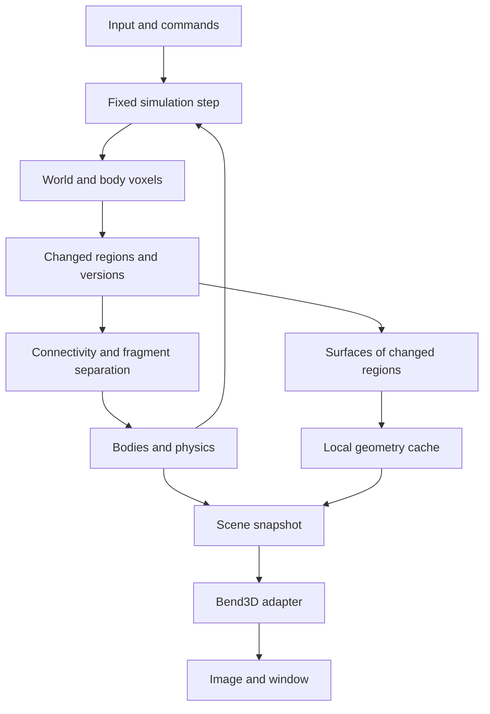

# Voxel Engine Architecture in Bend 2

Status: a proposal for the first technical prototype; the engine has not been implemented or benchmarked.

Confirmed goal: small, destructible voxels, architecture first, with the initial build running on the current Linux PC. Level scale, art style, and physics complexity remain unspecified. This proposal starts with a bounded arena, solid opaque materials, and detachable fragments.

## 1. Core decision

Build a custom core in Bend: a sparse voxel world, edit commands, connectivity analysis, physical bodies, surface generation, and an independent rendering interface. An adapted Bend3D serves as the first backend. Its suitability for the required geometry density must be measured separately.

Voxel storage is the source of truth. Meshes, query acceleration structures, the connectivity graph, and rendering data are versioned derived representations. Game logic does not depend on Bend3D internals.

Do not promise Teardown-level performance or a large open world. First measure editing, surface rebuilding, connectivity, and frame time on the target PC.

## 2. Verified foundation and limitations

Sources were inspected at commit `a49524265bdfa5753a4bf38e25f0574a705dd868`, rather than the moving `main` branch. The initial compiler was `bend 2.0.16`; the current project pin is `bend 2.0.25`. See [demo validation](demo-validation.md) for executable checks and compiler-specific measurements. Language and environment details are in [bend-feasibility.md](bend-feasibility.md).

[Bend3D](https://github.com/bendlang/bend/blob/a49524265bdfa5753a4bf38e25f0574a705dd868/demos/app_slash_boss_3d/bend3d.bend) provides vectors, a camera, materials, lighting, triangle projection, and rasterization through screen cells. `Frame.show` calls `Frame.node!`; this path has a root size of 2048 and 64-pixel cells. `Mesh.raster` discards a triangle if any vertex fails the near-plane test. It is a rasterizer, not a voxel storage or destruction system.

The [demo](https://github.com/bendlang/bend/blob/a49524265bdfa5753a4bf38e25f0574a705dd868/demos/app_slash_boss_3d/main.bend) uses `Window.open`/`Window.frame`; `Play.loop` separates scene construction and the GPU call with an IO boundary. Preserve this ordering until the runtime has been verified. Submit voxel surfaces as triangles, bypassing parametric `Surf` objects and their tessellation.

## 3. Target machine and initial budgets

Local inspection: Linux x86_64, Ryzen 5 1600 (6 cores / 12 threads), approximately 32 GB RAM, NVIDIA GTX 1660 (6144 MiB VRAM), driver 610.57.04, CUDA toolkit 13.3. Having CUDA installed does not by itself prove that Bend's GPU path works.

A minimal program using `pow2!(16n)` was successfully built with `CUDA_HOME=/opt/cuda bend ... -o ...` and run with `--gpu on`, producing 65536. Without that variable, the probe was built without a GPU module. The basic CUDA path therefore works here; engine performance and compatibility of the full Bend3D code remain to be checked.

Proposed experimental values, not file-format limits:

| Parameter | Initial hypothesis |
|---|---|
| Voxel size | 0.1 m, a configurable uniform scale |
| Test arena | 12.8 × 6.4 × 12.8 m |
| Brick, dense storage region | 8 × 8 × 8 cells |
| Chunk, management region | 32 × 32 × 32 cells, 4³ bricks |
| Internal frame | 640 × 360, then 960 × 540 |
| Simulation step | 60 Hz; initially target 30 FPS rendering |
| Active fragments | Initial cap of 128, subject to measurement |

At 16 packed bits per cell, a dense brick contains 1024 bytes of payload and a dense chunk contains 64 KiB. A 128 × 64 × 128 arena contains 2 MiB of payload. This is not a total memory estimate: Bend structures, versions, geometry, temporary results, and the image add overhead. Packing must be verified against the available API and measurements; an ordinary record with two fields does not guarantee a 16-bit representation.

## 4. Data and ownership

### Static world

`ChunkCoord -> Chunk` is a sparse spatial index; choose the concrete container after inspecting the local Base library and running a microbenchmark. A linear list of all voxels is unsuitable as the primary index. A simple table of occupied chunk slots is acceptable for the bounded test arena.

A chunk contains 64 brick slots. A brick is `Empty`, `Uniform(material)`, or `Dense(cells)`. Completely empty regions have no dense array. The first format stores a material ID; strength comes from the material table. Add accumulated damage as a separate optional layer only when needed.

World and chunk coordinates are signed integers. Negative coordinates require floor division and a nonnegative remainder: cell -1 belongs to chunk -1 with local coordinate 31. Body geometry lives in an integer local grid; conversion to world space is separate.

### Voxel body

`Body` contains a stable ID, its own voxel storage, position, orientation, linear and angular velocity, mass, center of mass, inertia tensor, and sleep state. Mass and inertia depend on material and geometry.

Rotating a body changes its transform; it does not require rewriting it into the static grid every frame. A sleeping body remains a body. Merging it back into the world is a separate operation with explicit precision-loss rules, outside the first version.

### Ownership and caches

The simulation owns mutable state. A processing stage takes ownership of a region and returns its updated state and changes. Do not assume a large `Array` can be copied, shared, or read in parallel for free: the contract depends on the Bend version.

The initial pipeline is sequential between phases, with parallel processing of independent regions within suitable phases. A render snapshot is an explicit package of geometry and transforms, with no arbitrary access to the live world. Allow one frame in flight initially; add CPU/GPU overlap only after measurement and explicit data lifetime management.

A rebuild job carries the region ID, its content version, and versions of neighboring boundaries. Publish the result only if its dependencies still match; discard stale results. This is a simple contract for the first synchronous prototype and protection against stale caches for future background construction.

## 5. Destruction and connectivity

Commands: remove a sphere, cut out a region, or apply an impact at a ray-query hit. Sphere removal is enough for the first experiment. Record each command's input at its tick with a sequence number; replay depends on the same initial world and command order.

1. Find affected chunks and bodies using bounding volumes.
2. For a body, transform the impact into its local coordinate system; body scale is one in the first version.
3. Edit only intersecting bricks; retain the list of cells and boundaries that actually changed.
4. Update geometry, collision, and connectivity versions. At a brick boundary, invalidate the corresponding neighbor; at a chunk boundary, invalidate the neighboring chunk.
5. Identify remaining connected components and their connections to anchors.
6. Atomically transfer detached components into new bodies and remove them from their previous owner.

Connectivity uses six face neighbors. Edge or corner contact does not support a structure. Fixed level regions are explicitly designated for the static world; the bottom layer is not automatically an anchor. A component with no path to an anchor becomes a body. When an existing dynamic body breaks, each component becomes a separate body.

Critical case: a small bridge is removed, causing a large wall spanning multiple chunks to fall. A local flood fill confined to the explosion region gives an incorrect answer. For the first small level, traversing the entire affected former component is acceptable. To scale: use local brick components plus a graph of connections across their boundaries. After deletion, the graph must also be checked for splits; union-find that only merges components is insufficient.

Checking a large component can be divided into work batches. Until classification completes, removed cells are already empty while the remaining structure temporarily retains its previous physical state. Connectivity results apply only to the version checked. This creates a measurable destruction latency limitation rather than instantaneous, physically exact destruction.

Fragment transfer conserves material: each remaining solid voxel has exactly one owner. When splitting a moving body, a component's initial velocity accounts for `v + ω × (c_new - c_old)`; the impact impulse is applied separately. Removing dust or discarding tiny fragments must be an explicit rule, not accidental material loss.

If the body cap is reached, preserve mass in sleeping or simplified bodies, or defer activation according to a documented rule. Particle limits can be applied separately: particles do not participate in solid voxel accounting.

## 6. Surfaces and rendering

The first mesher emits only faces between a solid cell and air, reading neighbors across storage boundaries as well. Next, merge adjacent coplanar faces of the same material (greedy meshing). Start at brick granularity, then compare with chunks: a smaller region is cheaper to rebuild; a larger one offers more opportunities to merge.

Store meshes in local coordinates. Camera or body motion does not trigger meshing. Cache keys depend on geometry, neighboring boundaries, and construction parameters. Normal direction and material are part of the merge criteria; if baked shading is added, it must also be compatible across the merged face.

Frame path:

`surface cache -> region visibility culling -> transform -> clipping -> projection/lighting -> screen Cells -> Frame.show -> Window.frame`.

Adapting Bend3D requires clipping triangles against the near plane before projection, checking face winding, and separate timing counters for screen-cell construction and rasterization. Screen `Cells` depend on the camera: caching surfaces does not eliminate their rebuild when the view changes. Keep both frame dimensions below 2048 in the first version; generalizing the tree is a separate task.

Initial lighting is ambient plus directional, with flat opaque materials. Add shadows, transparency, GI, and LOD after baseline measurements. An important worst-case test alternates empty and solid voxels, generating many faces with little opportunity for mesher compression.

### Why start with meshes

This tests the user-proposed Bend3D and separates destruction cost from image generation cost. An alternative is ray traversal through sparse bricks: potentially better for very fine geometry, but requiring custom traversal, acceleration, lighting, and data transfer. A full sparse voxel octree also complicates editing and body separation.

Hide the backend behind a contract that accepts a scene and returns an image and metrics. If projection, triangle distribution, or rasterization exceeds the budget on the GTX 1660, separately compare brick raycasting and an external graphics backend. Do not assume Vulkan/FFI support is ready for this; it is a separate technical experiment, not an existing engine capability.

## 7. Physics and queries

First stage: camera motion, voxel selection by ray, and destruction of a stationary scene. Next: a capsule player and one falling fragment, followed by body interactions.

Initial camera controls use the keyboard and mouse dragging for rotation. The inspected Base library exposes absolute mouse movement, but no public relative mouse / pointer lock operation was found. Continuous FPS mouse-look needs a separate platform effect. This limits the first interface, not world data.

A ray query traverses spatial regions and voxels using DDA; for bodies, transform the ray into local coordinates. Return the owner, cell coordinate, normal, and distance in a shared world-space metric. Explicitly define hits when the ray starts inside material and when boundary intersections tie.

The broad phase uses world-space AABBs of bodies and static regions. The initial narrow phase may be coarse and explicitly limited: a few volumes per body. Accurate voxel–voxel collision and stable stacking of rotating fragments are a substantial independent stage. An arbitrary visual mesh is not automatically a suitable collider.

A fixed step with a cap on catch-up ticks prevents unbounded lag. High velocities require substeps or swept checks. Identical command ordering is useful for reproducible tests but does not guarantee bitwise deterministic F32 physics across CPU and GPU.

## 8. Module boundaries

Proposed structure; no empty source files have been created:

| Module | Responsibility |
|---|---|
| `core` | Coordinates, IDs, geometric operations |
| `voxel` | Materials, bricks, chunks, access, and edits |
| `world` | Spatial index, anchors, owners, versions |
| `destruction` | Commands, connectivity, body separation |
| `physics` | Mass, motion, contacts, sleep |
| `meshing` | Exposed faces and face merging |
| `render` | Scene contract and Bend3D adapter |
| `platform` | Window, input, time, files |
| `sandbox` | Test arena and destruction tools |

The simulation runs without a window. The renderer does not change material; physics does not access screen triangles; platform code does not define destruction rules.

Persistence stores the format version, cell scale, material palette, static chunks, anchors, bodies, and their transforms. Geometry caches are not a required part of the saved world. A command log supports reproducible experiments; a full undo system and network protocol are outside the current scope.

## 9. Checks and proofs

Candidates for `LAWS.bend`/`PROOF.bend`, introduced alongside implementation with no `@unsafe` inside the verified core:

- Reading after writing returns the written material; other coordinates remain unchanged.
- Converting world coordinates to chunk/local coordinates and back preserves the value, including negative coordinates.
- Removal creates no solid material; repeating removal of the same region without intervening edits changes nothing.
- Splitting into bodies neither duplicates nor loses remaining voxels.

These are desired laws, not existing proofs. Data representation will determine formalization effort. Simple coordinate and access properties are the first candidates; correctness of the entire connectivity graph is substantially harder.

Practical tests complement proofs: an explosion at a four-chunk boundary, severing a bridge far from an anchor, destroying a rotating fragment, repeating a command, a stale meshing result, moving the camera through the near plane, and a large checkerboard mesh. Compare optimized meshing and connectivity with simple reference algorithms on small volumes.

## 10. Implementation sequence and continuation criteria

1. **Compatibility.** Pin the compiler and renderer commit; build a minimal window and verify actual GPU execution. Do not draw FPS conclusions before this.
2. **Storage and reference implementation.** Coordinates, materials, reads/writes, boundary tests, and a headless scene. Measure memory and local edit cost.
3. **Stationary scene.** Exposed faces, Bend3D adapter, clipping, and a free camera. Start at 640 × 360 and separately time meshing, frame preparation, GPU execution, and presentation.
4. **Destruction.** Sphere removal, correct boundary updates, and a versioned work queue. Measure command-to-visible-result latency.
5. **Fragments.** Anchors, complete reference connectivity, separation of one body, mass, and falling; then splitting a dynamic body.
6. **Scaling.** Greedy meshing, component graph, sleep, limits, and profiling of dense and fragmented scenes. Only then decide whether Bend3D remains the primary backend.

Initial rendering criterion: p95 frame time ≤33.3 ms in a reproducible scene at 640 × 360. This is a target, not a measured result. Alongside FPS, record solid cell count, face/triangle count, visible chunks, active bodies, RAM/VRAM, p50/p95/p99 frame times, backlog, and destruction latency. Fix scenes and command sequences; agree on a complex-destruction budget after initial measurements.

## 11. Open decisions

Further choices: close-up voxel detail, whether the entire level must be destructible, whether fragments must form stable piles, target world dimensions, and whether 60 FPS is mandatory. The proposed architecture allows work to begin without prematurely promising these properties.

When importing Bend3D sources, preserve attribution and applicable notices from the [repository license](https://github.com/bendlang/bend/blob/a49524265bdfa5753a4bf38e25f0574a705dd868/LICENSE). Demo sources have not yet been added to this project.
