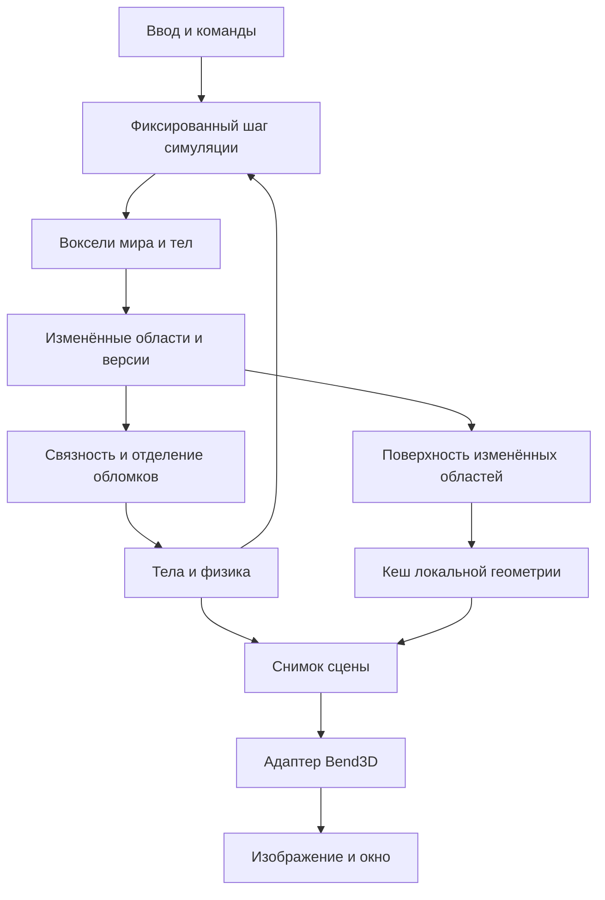

# Архитектура voxel-движка на Bend 2

Статус: предложение для первого технического прототипа; реализации и замеров движка пока нет.

Подтверждённая цель: мелкие разрушаемые воксели, сначала архитектура, первый запуск на текущем Linux-компьютере. Масштаб уровня, художественный стиль и сложность физики ещё не заданы. Ниже предлагается ограниченная арена с твёрдыми непрозрачными материалами и отделяющимися обломками.

## 1. Главный выбор

Предлагается собственное ядро на Bend: разреженный воксельный мир, команды изменения, поиск связности, физические тела, построение поверхности и независимый интерфейс отрисовки. Первым backend служит адаптированный Bend3D. Пригодность его растеризатора для нужной плотности геометрии проверяется отдельно.

Хранение вокселей — источник истины. Меш, ускорители запросов, граф связности и данные отрисовки — производные представления с версиями. Игровая логика не зависит от устройства Bend3D.

Не обещаем производительность Teardown или большого открытого мира: сначала измеряем редактирование, перестроение поверхности, связность и кадр на конкретном ПК.

## 2. Проверенная база и ограничения

Исходники исследованы на коммите `a49524265bdfa5753a4bf38e25f0574a705dd868`, а не на плавающем `main`. Установленный компилятор: `bend 2.0.16`. Совместимость всего демо с ним не проверялась; обновление не выполнялось. Подробности языка и среды: [bend-feasibility.md](bend-feasibility.md).

В [Bend3D](https://github.com/bendlang/bend/blob/a49524265bdfa5753a4bf38e25f0574a705dd868/demos/app_slash_boss_3d/bend3d.bend) есть векторы, камера, материалы, освещение, проекция треугольников и растеризация по экранным ячейкам. `Frame.show` вызывает `Frame.node!`; корневой размер в этом пути — 2048, ячейки — 64 пикселя. `Mesh.raster` отбрасывает треугольник, если хотя бы одна вершина не прошла ближнюю плоскость. Это растеризатор, а не система хранения и разрушения вокселей.

[Демо](https://github.com/bendlang/bend/blob/a49524265bdfa5753a4bf38e25f0574a705dd868/demos/app_slash_boss_3d/main.bend) использует `Window.open`/`Window.frame`; `Play.loop` разделяет построение сцены и GPU-вызов границей IO. Этот порядок стоит сохранить до проверки runtime. Воксельную поверхность подаём треугольниками, обходя параметрические `Surf` и их тесселяцию.

## 3. Целевая машина и стартовые бюджеты

Локальная проверка: Linux x86_64, Ryzen 5 1600 (6 ядер / 12 потоков), около 32 ГБ RAM, NVIDIA GTX 1660 (6144 MiB VRAM), драйвер 610.57.04, CUDA toolkit 13.3. Наличие CUDA само по себе не доказывает работу GPU-пути Bend.

Минимальная программа с `pow2!(16n)` успешно собрана через `CUDA_HOME=/opt/cuda bend ... -o ...` и запущена с `--gpu on`, результат — 65536. Без этой переменной проба собиралась без GPU-модуля. Значит, базовый CUDA-путь здесь работает; производительность движка и совместимость полного Bend3D ещё предстоит проверить.

Предлагаемые значения для эксперимента, не ограничения формата:

| Параметр | Начальная гипотеза |
|---|---|
| Размер вокселя | 0,1 м, конфигурируемый единый масштаб |
| Тестовая арена | 12,8 × 6,4 × 12,8 м |
| Brick, плотная область | 8 × 8 × 8 ячеек |
| Chunk, область управления | 32 × 32 × 32 ячейки, 4³ bricks |
| Внутренний кадр | 640 × 360, затем 960 × 540 |
| Шаг симуляции | 60 Гц; сначала целевой рендер 30 FPS |
| Активные обломки | Начальный предел 128, уточнить замерами |

При упаковке по 16 бит на ячейку один плотный brick содержит 1024 байта полезных данных; плотный chunk — 64 KiB. Для арены 128 × 64 × 128 это 2 MiB полезных данных. Это не оценка всей памяти: структуры Bend, версии, геометрия, временные результаты и изображение добавляют расходы. Упаковка должна быть подтверждена доступным API и замерами; обычная запись с двумя полями не гарантирует 16-битное представление.

## 4. Данные и владение

### Статический мир

`ChunkCoord -> Chunk` — разреженный пространственный индекс; конкретный контейнер выбирается после проверки локальной Base и микробенчмарка. Линейный список всех вокселей не подходит как основной индекс. Для ограниченной тестовой арены допустима простая таблица занятых chunk-слотов.

Chunk содержит 64 brick-слота. Brick бывает `Empty`, `Uniform(material)` или `Dense(cells)`. У полностью пустых областей нет плотного массива. Первый формат хранит material ID; прочность берётся из таблицы материалов. Накопленное повреждение добавляется отдельным необязательным слоем только при необходимости.

Координаты мира и chunk — знаковые целые. Для отрицательных координат требуются деление с округлением вниз и неотрицательный остаток: ячейка -1 принадлежит chunk -1 с локальной координатой 31. Геометрия тел хранится в целой локальной решётке, преобразование в мировое пространство выполняется отдельно.

### Воксельное тело

`Body` содержит устойчивый ID, собственное воксельное хранилище, положение, ориентацию, линейную и угловую скорость, массу, центр масс, тензор инерции и состояние сна. Масса и инерция зависят от материала и геометрии.

Вращение тела меняет transform; перезаписывать его в статическую сетку каждый кадр не нужно. Уснувшее тело остаётся телом. Обратное слияние с миром — отдельная операция с правилами потери точности, за пределами первой версии.

### Владение и кеши

Симуляция владеет изменяемым состоянием. Этап обработки получает область во владение и возвращает новое состояние с изменениями. Нельзя предполагать, что большой `Array` можно бесплатно копировать, разделять или читать параллельно: контракт зависит от версии Bend.

Начальный конвейер последовательный между фазами, с параллельной обработкой независимых областей внутри подходящих фаз. Render snapshot — явный пакет геометрии и преобразований, без произвольного доступа к живому миру. Сначала разрешён один кадр в работе; перекрытие CPU/GPU добавляется только после замеров и определения времени жизни данных.

У задания перестроения есть ID области и версия её содержимого, а также версии границ соседей. Результат публикуется только при совпадении зависимостей; старые результаты отбрасываются. Для первого синхронного прототипа это простой контракт, для будущего фонового построения — защита от устаревшего кеша.

## 5. Разрушение и связность

Команды: удалить сферу, вырезать область, нанести удар по результату лучевого запроса. Для первого эксперимента достаточно удаления сферы. Вход каждой команды фиксируется на тике вместе с последовательным номером; повтор зависит от того же начального мира и порядка команд.

1. Найти затронутые chunks и тела по ограничивающим объёмам.
2. Для тела перевести воздействие в его локальную систему; масштаб тел в первой версии единичный.
3. Изменить только пересекающиеся bricks; сохранить список действительно изменённых ячеек и границ.
4. Обновить версии геометрии, коллизий и связности. На границе brick инвалидировать соответствующего соседа; на границе chunk — соседний chunk.
5. Определить оставшиеся связные компоненты и их связь с опорами.
6. Атомарно перенести отделившиеся компоненты в новые тела и удалить их из прежнего владельца.

Связность определяется шестью соседями по граням. Касание ребром или углом не удерживает конструкцию. Для статического мира явно задаются закреплённые области уровня; нижний слой не становится опорой автоматически. Компонента без пути к опоре превращается в тело. Для уже динамического тела после разрыва каждая компонента получает отдельное тело.

Ключевой случай: выбита маленькая перемычка, а падает большая стена в нескольких chunks. Локальный flood fill внутри области взрыва даст неверный ответ. Для первого небольшого уровня допустим полный обход затронутой прежней компоненты. Для масштабирования: локальные компоненты bricks плюс граф связей через их границы. После удаления граф тоже надо проверять на раскол; одного union-find, умеющего только объединять, недостаточно.

Проверку большой компоненты можно разбить на порции работы. Пока классификация не завершена, удалённые ячейки уже пусты, а оставшаяся конструкция временно сохраняет прежнее физическое состояние. Результат связности применим только к проверенной версии. Это измеримое ограничение задержки разрушения, а не мгновенное физически точное разрушение.

Передача обломков сохраняет материал: каждый оставшийся твёрдый воксель имеет ровно одного владельца. При разделении движущегося тела начальная скорость компоненты учитывает `v + ω × (c_new - c_old)`; импульс удара применяется отдельно. Выбор удаляемой пыли или исчезновения микрофрагментов должен быть явным правилом, а не случайной потерей материала.

Если лимит тел исчерпан, сохраняем массу в спящих/упрощённых телах либо откладываем активацию по документированному правилу. Лимит частиц можно применять отдельно: частицы не участвуют в балансе твёрдых вокселей.

## 6. Поверхность и рендер

Первый mesher выпускает только грани между твёрдой ячейкой и воздухом; соседей читает и через границы хранения. Следующий шаг — объединение соседних граней одного материала на одной плоскости (greedy meshing). Начать с brick, затем сравнить с chunk: маленькая область дешевле перестраивается, большая даёт больше возможностей объединения.

Меш хранится в локальных координатах. Движение камеры или тела не запускает meshing. Ключи кеша зависят от геометрии, соседних границ и параметров построения. Направление нормали и материал входят в условия объединения; если добавляется запечённое затенение, оно также должно быть совместимо на объединённой грани.

Путь кадра:

`кеш поверхности -> отсечение невидимых областей -> transform -> clipping -> проекция/свет -> экранные Cells -> Frame.show -> Window.frame`.

Для адаптации Bend3D нужны отсечение треугольников по near plane до проекции, проверка winding граней, отдельные счётчики построения экранных ячеек и растеризации. Экранные `Cells` зависят от камеры: кеширование поверхности не отменяет их перестроение при изменении вида. Для первой версии сохраняем кадр меньше 2048 по обеим осям; обобщение дерева — отдельная задача.

Первый свет — окружающий плюс направленный, плоские непрозрачные материалы. Тени, прозрачность, GI и LOD добавляются после базовых замеров. Особенно важен неблагоприятный тест: чередование пустых и твёрдых вокселей создаёт множество граней и почти не сжимается mesher.

### Почему начать с мешей

Это позволяет проверить предложенный пользователем Bend3D и отделить стоимость разрушения от стоимости изображения. Альтернатива — лучи по разреженным bricks: потенциально лучше для очень мелкой геометрии, но потребует собственного traversal, ускорения, света и пути передачи данных. Полное sparse voxel octree также усложняет редактирование и разделение тел.

Backend скрывается за контрактом получения сцены и возврата изображения/метрик. Если проекция, распределение треугольников или растеризация не укладываются в бюджет на GTX 1660, отдельно сравниваем brick raycasting и внешний графический backend. Готовность Vulkan/FFI для этого не предполагается; это отдельный технический эксперимент, а не уже доступная возможность движка.

## 7. Физика и запросы

Для первого этапа: движение камеры, лучевой выбор вокселя, разрушение неподвижной сцены. Следом — игрок-капсула и падение одного обломка, затем взаимодействие тел.

Первое управление камерой — клавиатура и вращение при перетаскивании мышью. В исследованной Base есть абсолютные движения мыши, но публичный relative mouse / pointer lock не найден; непрерывный FPS mouse-look потребует отдельного platform effect. Это ограничение первого интерфейса, а не данных мира.

Лучевой запрос проходит пространственные области и воксели алгоритмом DDA; для тел луч преобразуется в локальные координаты. Возвращает владельца, координату ячейки, нормаль и расстояние в общей мировой метрике. Отдельно определить попадание при старте луча внутри материала и равных пересечениях границ.

Broad phase использует мировые AABB тел и статических областей. Узкая фаза сначала может быть грубой и явно ограниченной: несколько объёмов на тело. Точная коллизия voxel–voxel и стабильное складывание вращающихся обломков — самостоятельный большой этап. Произвольный визуальный меш не считается автоматически хорошим коллайдером.

Фиксированный шаг с ограничением количества догоняющих тиков предотвращает бесконечное отставание. Высокие скорости требуют подшагов или swept-проверок. Идентичный порядок команд полезен для повторяемых тестов, но не гарантирует побитовую детерминированность F32-физики между CPU и GPU.

## 8. Границы модулей

Предлагаемая структура, пока без создания пустых исходников:

| Модуль | Ответственность |
|---|---|
| `core` | Координаты, ID, геометрические операции |
| `voxel` | Материалы, bricks, chunks, доступ и изменения |
| `world` | Пространственный индекс, опоры, владельцы, версии |
| `destruction` | Команды, связность, разделение тел |
| `physics` | Масса, движение, контакты, сон |
| `meshing` | Открытые грани и их объединение |
| `render` | Контракт сцены и адаптер Bend3D |
| `platform` | Окно, ввод, время, файлы |
| `sandbox` | Тестовая арена и инструменты разрушения |

Симуляция запускается без окна. Renderer не меняет материал; physics не получает доступ к экранным треугольникам; platform не определяет правила разрушения.

Сохранение: версия формата, масштаб ячейки, палитра материалов, статические chunks, опоры, тела и их transforms. Кеши геометрии не сохраняются как обязательная часть мира. Журнал команд нужен для воспроизводимых испытаний; полноценная система undo и сетевой протокол пока вне задачи.

## 9. Проверки и доказательства

Кандидаты для `LAWS.bend`/`PROOF.bend`, вводимые вместе с реализацией и без `@unsafe` внутри доказываемого ядра:

- Чтение после записи возвращает записанный материал; остальные координаты не меняются.
- Преобразование мировой координаты в chunk/local и обратно сохраняет значение, включая отрицательные координаты.
- Удаление не создаёт твёрдый материал; повторное удаление той же области без промежуточных изменений ничего не меняет.
- Разделение на тела не дублирует и не теряет оставшиеся воксели.

Это желаемые законы, не уже существующие доказательства. Представление данных определит трудоёмкость формализации. Простые свойства координат и доступа — первые кандидаты; корректность всего графа связности существенно сложнее.

Практические тесты дополняют доказательства: взрыв на границе четырёх chunks, разрыв перемычки вдали от опоры, разрушение вращающегося обломка, повтор команды, устаревший meshing result, проход камеры через near plane, большой checkerboard-меш. Сравниваем оптимизированный mesher и связность с простыми эталонными алгоритмами на малых объёмах.

## 10. Порядок реализации и критерии продолжения

1. **Совместимость.** Зафиксировать компилятор и renderer-коммит; собрать минимальное окно и проверить реальный GPU-путь. Без этого не делать выводов о FPS.
2. **Хранилище и эталон.** Координаты, материалы, чтение/запись, тесты границ и headless-сцена. Измерить память и стоимость локального изменения.
3. **Неподвижная сцена.** Открытые грани, адаптер Bend3D, clipping, свободная камера. Сначала 640 × 360, отдельно времена meshing, подготовки кадра, GPU и показа.
4. **Разрушение.** Удаление сферы, корректное обновление границ, очередь работ с версиями. Измерять задержку от команды до видимого результата.
5. **Обломки.** Опоры, полная эталонная связность, отделение одного тела, масса и падение; затем раскол динамического тела.
6. **Масштабирование.** Greedy meshing, граф компонентов, сон, лимиты и профилирование плотных/фрагментированных сцен. Только здесь решать, остаётся ли Bend3D основным backend.

Стартовый критерий рендера: p95 кадра ≤33,3 мс в воспроизводимой сцене при 640 × 360. Это целевой порог, не полученный результат. Кроме FPS записывать число твёрдых ячеек, граней/треугольников, видимых chunks, активных тел, RAM/VRAM, p50/p95/p99 времени кадра, backlog и задержку разрушения. Сцены и последовательности команд должны быть фиксированы; бюджет сложного разрушения согласуется после первых измерений.

## 11. Открытые решения

Далее потребуют выбора: насколько детальны воксели вблизи, нужен ли полностью разрушаемый уровень, должны ли обломки создавать устойчивые завалы, целевые размеры мира и обязательность 60 FPS. Предлагаемая архитектура позволяет начать без преждевременного обещания этих свойств.

При переносе исходников Bend3D сохранить сведения об источнике и применимые уведомления [лицензии репозитория](https://github.com/bendlang/bend/blob/a49524265bdfa5753a4bf38e25f0574a705dd868/LICENSE). Исходники демо пока не добавлены в проект.
