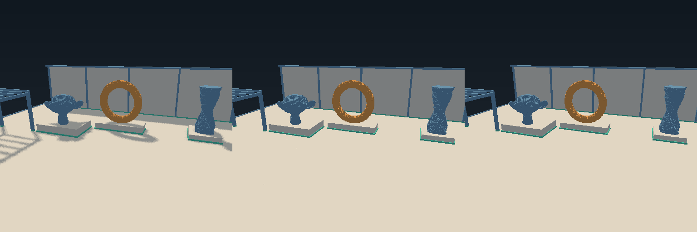

# Minimal DDA comparison

`dda.bend` is a standalone voxel renderer. It clips each camera ray to a grid, walks boundaries in depth order, and stops at the first occupied surface. A camera inside a solid sees its exit surface. Traversal has a `3 * side + 1` step bound. Exact crossing ties advance every tied axis and select the X, Y, or Z face in that order. The current default crosses uniform tree regions. [DDA region traversal](dda-optimization.md) explains that optimization and its measurements.

The grid is a compressed binary material tree. Splits cycle through X, Y, and Z. Dense bodies retain their affine array. Cuboid bodies are painted into the tree without allocating a dense 512³ array. The original body returns beside its derived grid. The renderer uses the existing camera rays, daylight material colors, background, and ground grid. All five material palettes are cached. Shadows and the interactive brush preview are omitted.

`scripts/dda_compare.bend` provides four render modes:

| Mode | Geometry path | Lighting |
| --- | --- | --- |
| `dda` | Uniform-region traversal | Daylight without shadows |
| `dda-step` | Original unit-voxel traversal | Daylight without shadows |
| `faces` | Existing projected-face and tile renderer | The same daylight without shadows |
| `existing` | Existing production renderer | Cached daylight and soft shadows |

The `faces` mode uses `R.Projected.list` and `R.Tiles.image` from the existing renderer. The `existing` mode builds and draws the normal `R.RenderScene`. The ordinary application continues to use the production renderer.

## Run the comparison

Build both tools:

```sh
	make build/dda-compare build/dda-benchmark
```

Compare every pixel's ray intersection against the existing face renderer:

```sh
	./build/dda-compare --gpu off --threads 1 -- --verify
	./build/dda-compare --gpu off --threads 1 -- --cube --cut --verify
	./build/dda-compare --gpu off --threads 1 -- --cube --view inside --verify
```

`--verify` checks 262,144 rays. It exits unsuccessfully if hit coverage differs or if a common hit's depth differs by more than 0.001 voxel units. It also reports exact cell, face-direction, and unshadowed color differences. `--view axis` and `--view opposite` select additional cube views.

`--verify-steps` instead compares region traversal against the unit walk. It requires exactly equal hit presence, depth, cell, face direction, and material for all 262,144 rays.

Export either renderer:

```sh
	./build/dda-compare --gpu off -- --renderer dda --dump build/dda.ppm
	./build/dda-compare --gpu off -- --renderer faces --dump build/faces.ppm
	./build/dda-compare --gpu off -- --renderer existing --dump build/existing.ppm
```

Measure native displayed frames with all three modes in one process:

```sh
	./build/dda-benchmark --gpu off --threads 12 -- --frames 12 --repeats 5 --label cpu-12 --output build/dda-cpu.tsv
	./build/dda-benchmark --gpu on --threads 1 -- --frames 12 --repeats 5 --tile-depth 7 --fork-depth 7 --label gpu-7 --output build/dda-gpu.tsv
```

Run these commands from the repository directory. `--label` is a report label supplied by the caller. Native runtime options select the actual execution lane and CPU thread count. Add `--cube` or `--cube --cut` to select the smaller workloads. `--tile-depth` and `--fork-depth` accept 0 through 9. DDA uses the fork depth, while its sequential leaves always cover the remaining image levels. The face renderer uses both depths.

Initialization happens once per mode, outside all measurements. Each sample excludes four warm-up frames and includes rendering, `Window.frame`, and complete image disposal. Alternate repetitions reverse the renderer order. Reports retain every sample, the median, and the range. The benchmark requires at least five repetitions and stops on IO or numeric failures.

Add `--steps` to include `dda-step` in the alternating measurements.

For separate startup and frame-phase diagnostics:

```sh
	./build/dda-compare --gpu off --threads 12 -- --renderer dda --profile
```

## Validation

The opening, carved, opposite, and inside-solid cube views agree on coverage, depth, cell, face direction, and color for every ray. The Atelier opening view agrees on coverage and depth for every ray. Seven pixels choose different cells, four choose different face directions, and three have different unshadowed colors. The common depths agree exactly. DDA's fixed axis priority differs from the existing renderer's face-list priority at coincident boundaries.

The complete DDA Atelier exports agree byte for byte across sequential CPU execution, twelve-thread CPU execution at fork depths 5, 6, and 7, and strict GPU execution at those three depths. [verification.txt](dda-data/verification.txt) records the ray results, export hashes, and both successful proof gates. These comparisons do not establish shadow equivalence. The minimal renderer deliberately omits shadow sampling.

The added laws prove uniform-tree reads, preservation of cached daylight colors, empty out-of-bounds reads, preservation under disjoint paint, face-flip involution, stationary-axis behavior, unchanged uncrossed coordinates, and termination at zero fuel. They do not prove that DDA and face traversal are equivalent for every possible body or floating-point ray. Complete runtime ray comparisons provide the scene evidence above.



## Measurement record

The tables below record the original unit-step DDA before region traversal was added. Their `dda` rows correspond to the algorithm now selected by `dda-step`. The source and binary hashes in the original manifest identify that version. Current region results are recorded separately in [DDA region traversal](dda-optimization.md).

The measurements use Bend 2.0.34 on a Ryzen 5 1600 with 12 logical CPU threads and a GeForce GTX 1660. They run through the real native X11 window on the development desktop. Other desktop applications remain active, so renderer order is alternated within each configuration. CPU and GPU configurations run sequentially.

On the default 12-thread CPU configuration, minimal DDA is 8.95 times slower than the production renderer and 11.00 times slower than the same face renderer without shadows. These are medians of five interleaved samples, with four measured frames per sample.

| CPU configuration | DDA ms/frame | Face renderer without shadows ms/frame | Production renderer ms/frame |
| --- | --- | --- | --- |
| 1 thread, sequential image leaves | 7484 | 606 | 673 |
| 6 threads, tile and fork depth 6 | 1388 | 115.75 | 147.25 |
| 12 threads, tile and fork depth 6 | 1031.50 | 93.75 | 115.25 |

The 12-thread ranges are 1028.75 to 1036.00 ms for DDA, 92.25 to 94.75 ms for the face control, and 113.75 to 118.00 ms for production. The one-thread samples measure one frame each. Their much longer frame times still give a clear separation. The six-thread and twelve-thread samples measure four frames each.

Raw samples are in [cpu-1.tsv](dda-data/cpu-1.tsv), [cpu-6.tsv](dda-data/cpu-6.tsv), and [cpu-12.tsv](dda-data/cpu-12.tsv). [manifest.txt](dda-data/manifest.txt) records the hardware, starting load, and source and executable hashes.

GPU measurements vary image work decomposition separately. Each sample measures two frames after four warm-up frames, and each configuration has five repetitions.

| GPU tile and fork depth | DDA ms/frame | Face renderer without shadows ms/frame | Production renderer ms/frame |
| --- | --- | --- | --- |
| 5 | 3418.50 | 4646.00 | 5282.00 |
| 6 | 2788.50 | 1086.00 | 1294.50 |
| 7 | 2693.50 | 734.50 | 802.00 |

DDA beats the face renderer at depth 5. The face renderer improves much more at depths 6 and 7, however. At depth 7, production is 3.36 times faster than DDA. The DDA ranges overlap between depths 6 and 7, so this run does not establish a DDA improvement between those depths. At depth 7, DDA ranges from 2553.50 to 2778.00 ms/frame and production from 797.00 to 869.50 ms/frame. Both renderers perform better on the available CPU than on this GPU.

Raw GPU samples are in [gpu-5.tsv](dda-data/gpu-5.tsv), [gpu-6.tsv](dda-data/gpu-6.tsv), and [gpu-7.tsv](dda-data/gpu-7.tsv).

The small cube behaves differently. These runs use twelve CPU threads, depth 6, five repetitions, and twelve measured frames per sample.

| Body | DDA ms/frame | Face renderer without shadows ms/frame | Production renderer ms/frame |
| --- | --- | --- | --- |
| Full 8³ cube | 18.58 | 21.42 | 44.42 |
| Carved 8³ cube | 18.58 | 21.67 | 43.25 |

DDA displays the cube faster than the shadowed production renderer. The matched-lighting controls overlap DDA's ranges, so these samples do not establish a traversal speed advantage on the cube. For the full cube, DDA ranges from 16.75 to 21.25 ms/frame and the face control from 17.67 to 21.67 ms/frame. Native presentation cadence can affect these shorter frame times. Raw samples are in [cube.tsv](dda-data/cube.tsv) and [cube-cut.tsv](dda-data/cube-cut.tsv).

The recorded matrix can be rerun with these options:

```sh
	./build/dda-benchmark --gpu off --threads 1 -- --frames 1 --repeats 5 --fork-depth 0 --label atelier-cpu-1-sequential --output build/dda-cpu-1.tsv
	for threads in 6 12; do
		./build/dda-benchmark --gpu off --threads "$threads" -- --frames 4 --repeats 5 --label "atelier-cpu-$threads" --output "build/dda-cpu-$threads.tsv"
	done
	for depth in 5 6 7; do
		./build/dda-benchmark --gpu on --threads 1 -- --frames 2 --repeats 5 --tile-depth "$depth" --fork-depth "$depth" --label "atelier-gpu-$depth" --output "build/dda-gpu-$depth.tsv"
	done
	./build/dda-benchmark --gpu off --threads 12 -- --cube --frames 12 --repeats 5 --label cube-cpu-12 --output build/dda-cube.tsv
	./build/dda-benchmark --gpu off --threads 12 -- --cube --cut --frames 12 --repeats 5 --label cube-cut-cpu-12 --output build/dda-cube-cut.tsv
```

The profiler identifies material-tree lookup and the DDA walk as the main work. A separate diagnostic build compiled with `clang -O3 -pg` attributed 59.7% of sampled CPU time to `Tree.read` and 35.6% to `Trace.walk`. That diagnostic preceded plaster palette caching. It counted 843,156,408 tree lookups across eight complete images, about 105 million lookups per frame. Profiled times are excluded from the comparison.

[profile.txt](dda-data/profile.txt) records that attribution and separate native phase diagnostics. A final GPU depth-7 diagnostic attributes 2389 ms to DDA rendering, 128 ms to presentation, and 3 ms to disposal. The comparable production diagnostic measures 826 ms, 457 ms, and 3 ms. These one-frame diagnostics are separate from the repeated timing matrix. They identify rendering as DDA's main cost on both lanes.

This experiment measures this compressed-tree DDA implementation and these scenes. It does not establish a limit for DDA renderers with different storage or empty-space skipping.
