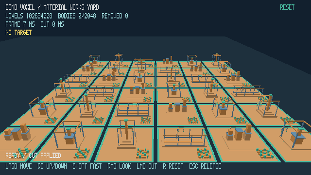
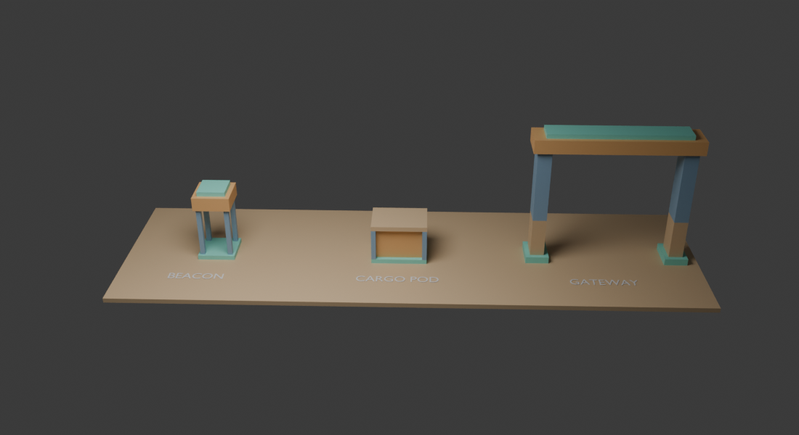

# Material Works Yard

The default interactive scene is a 6 × 6 grid of 64-meter tiles, spanning 384 × 384 meters. Each tile has a protected foundation, a concrete surface, one of four large structures, a gateway, and a 5 × 5 cluster of smaller beacon and cargo props. A 46-meter signal needle marks the center. The world contains 102,634,228 occupied 10 cm voxels and 1,009 anchored bodies. All four stable material IDs appear in the structures and props: green foundation, tan concrete, blue frame, and orange machinery.



The opening camera sees the whole yard. In the [two-frame LOD sample](validation/material-works-yard/lod-sample.csv), 984 bodies are visible; 875 are represented by 35 cached tile proxies, leaving 144 scene draws. This is a rendering choice: bodies remain full resolution for picking, cuts, connectivity, and motion. The [renderer guide](vulkan-renderer.md#render-lod) explains the LOD thresholds and cache behavior. Hold Shift while moving to travel at 60 m/s across the yard.

## Edit the Blender assets

[showcase_assets.blend](../assets/showcase_assets.blend) contains three editable voxel assets: a beacon, cargo pod, and gateway. The presentation floor, labels, camera, and light are for preview and are not exported.



Each asset collection has `voxel_asset` and `voxel_origin` custom properties. Every solid part is a box mesh with a `voxel_material` property from 1 to 4. Keep its eight corners axis-aligned on the 10 cm grid. Boxes within one asset must not overlap, and each asset needs a ground-level foundation box. Blender uses Z-up; the exporter maps Blender X/Y/Z to engine X/Z/Y.

The beacon and cargo pod must stay within 1.2 meters of their local center in both horizontal directions so their repeated instances do not overlap. The gateway has a 5-meter half-width and 2-meter half-depth limit. The exporter enforces these footprints.

Blender's colors preview the four IDs. The in-engine colors come from the OKLCH definitions in [material.hpp](../src/vulkan/material.hpp); changing a Blender swatch alone does not change that palette.

After editing and saving the `.blend` file, regenerate the Bend source and verify the scene:

```sh
make export-showcase-assets
make build
make test
```

The exporter validates box shapes, bounds, materials, anchors, and overlap before writing [showcase_assets.bend](../src/showcase_assets.bend). Commit the `.blend` file and generated Bend file together. [create_showcase_assets.py](../scripts/create_showcase_assets.py) records how the initial assets were built and refuses to replace an existing `.blend` file.

The large structures and tile placement are generated in [showcase.bend](../src/showcase.bend). The earlier demolition district and its exact-inventory stress workloads remain in [district.bend](../src/district.bend); run them with `VOXEL_DISTRICTS=1`, `4`, or `16`.
