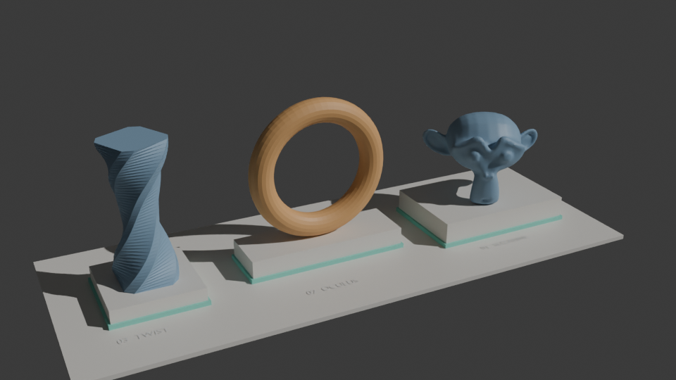

# Light Atelier

The default demo is a 44 × 34 meter sculpture courtyard designed to show lighting, cast shadows, and imported Blender geometry immediately. The opening camera looks across three large sculptures at close range. Pale plaster floors and pedestals receive their shadows; a slatted canopy casts a repeated stripe pattern onto the foreground.


The exhibits are **Suzanne**, a subdivided Blender monkey head; **Oculus**, a vertical torus with an open center; and **Twist**, an octagonal column swept through 207°. Their curved silhouettes and 10 cm voxel steps come from actual Blender meshes. They are fully editable game geometry, with protected footings and normal carving, connectivity, surface caching, and shadow updates.

The courtyard has six bodies: the floor, backdrop, canopy, and three exhibits. It focuses the existing 2,048² sun shadow map on a much smaller area than the earlier Material Works Yard. The new plaster material has a pale OKLCH color that makes warm sunlight and cool shadows easy to distinguish. Sunlight arrives at a lower angle, producing longer shadows. Shadow filtering compares each sampled texel with the receiver plane's depth to prevent diagonal self-shadow stripes on the walls.

Hold **L** to compare the [night view](validation/light-atelier/night.png), with cool ambient light and a stronger warm work light around the camera. Use WASD and Q/E to approach the voxel steps, RMB to look, LMB to carve, and R to restore the sculptures and the opening camera. The sun casts shadows; the camera work light does not. Render LOD remains available as you move away, while the opening view shows the full meshes.

```sh
VOXEL_RESOLUTION=1280x720 make run
```

## Blender source and import

[light_atelier.blend](../assets/light_atelier.blend) contains the three source assets in named collections. The preview floor, labels, camera, and sun are excluded from export. Suzanne's subdivision, remesh, and smoothing modifiers remain editable in the source; the remesh closes its eye sockets for solid voxelization. Its `voxel_remove_isolated` object property opts into discarding solitary sampled voxels with no face-connected neighbor. The exporter reports this cleanup; other objects preserve all sampled cells by default.



| Asset | Mesh voxels, excluding pedestal | Exported cuboids, including pedestal |
| --- | ---: | ---: |
| Suzanne | 21,020 | 731 |
| Oculus | 15,464 | 628 |
| Twist | 20,104 | 642 |

To change or replace an exhibit:

1. Open the source file in Blender. Import or append a model and move its solid mesh objects directly into the appropriate asset collection.
2. Keep the collection's `voxel_asset` name and `voxel_origin` placement origin. Assign each mesh an integer `voxel_material`: 1 foundation, 2 concrete, 3 frame, 4 machinery, or 5 plaster. Use separate objects for different game materials.
3. Keep a ground-level foundation part and connect the sculpture to its pedestal. Avoid overlapping occupied cells. New collections generate new asset functions; place them through `src/showcase.bend`.
4. Save the source, export, build, and verify:

```sh
make export-atelier-assets
make test-blender
make build
make test
```

The exporter evaluates modifiers and world transforms, maps Blender X/Y/Z to engine X/Z/Y, samples closed manifold meshes at 10 cm cell centers, and merges same-material cells into disjoint cuboids. Exact grid-aligned boxes keep their exact bounds. Closed cavities remain empty; details thinner than a voxel can disappear. Blender material swatches preview the IDs; the game's colors come from `src/vulkan/material.hpp`.

Each non-box mesh is limited to one million candidate cells, and each asset to 4,096 cuboids. Large curved meshes can cost more to carve and rebuild than their occupied-cell count suggests. Export validates closure, materials, anchor presence, bounds, and overlap; the engine tests additionally verify connectivity and the ring's open center.

Commit the source `.blend` and generated [atelier_assets.bend](../src/atelier_assets.bend) together. [create_light_atelier.py](../scripts/create_light_atelier.py) records the initial authoring steps and refuses to overwrite the source unless explicitly given `--replace`.

## Scale workloads and earlier assets

The demolition district remains available with `VOXEL_DISTRICTS=1`, `4`, or `16`; its [stress suite](stress-benchmark.md) still measures world scale, view changes, destruction, and falling bodies. The earlier [showcase_assets.blend](../assets/showcase_assets.blend) and `make export-showcase-assets` retain the beacon, cargo pod, and gateway import examples. Their repeated-layout footprint limits still apply. Earlier yard screenshots are preserved under `docs/validation/material-works-yard/`.

See the [Light Atelier validation record](validation/light-atelier/README.md) for captures and checks.
