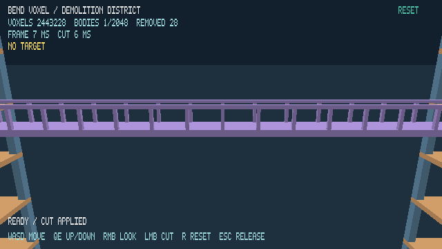

# Demolition district validation

The full 12-case suite passed on an AMD Ryzen 5 1600 / NVIDIA GTX 1660 desktop with driver 610.57.04. Each case used 30 warm-up frames, 180 measured frames, a 640 × 360 logical view, CPU Bend execution, and Vulkan immediate presentation. This is one measured run on one machine; timings are not GPU timestamps or a cross-version speedup claim.

Source revision: `bbbeace8280f1b3805f3b0bb81558ab1715ddd8f`. The working tree was clean. [report.json](report.json) contains source hashes, frame and phase distributions, workload checks, and cache telemetry. Each case has an unchanged raw CSV compressed as `.csv.gz`, plus its stderr log.

```sh
make test
make build
python3 scripts/benchmark_stress.py --output build/district-final
```

## Results

| Workload | Occupied cells | FPS | Frame p95 (ms) | Peak moving bodies | Meshes rebuilt during measurement |
| --- | ---: | ---: | ---: | ---: | ---: |
| district | 2,443,284 | 1697.2 | 1.059 | 0 | 0 |
| district-4 | 9,773,136 | 806.1 | 2.138 | 0 | 0 |
| district-16 | 39,092,544 | 235.3 | 5.980 | 0 | 0 |
| district-camera | 2,443,284 | 1685.8 | 1.006 | 0 | 0 |
| district-camera-4 | 9,773,136 | 775.0 | 2.094 | 0 | 0 |
| district-camera-16 | 39,092,544 | 237.2 | 5.817 | 0 | 0 |
| district-aim | 2,443,284 | 1552.0 | 1.063 | 0 | 0 |
| district-aim-16 | 39,092,544 | 746.6 | 1.772 | 0 | 0 |
| district-carve | 2,443,284 | 1298.4 | 1.189 | 0 | 6 |
| district-bridge | 2,443,284 | 1609.9 | 0.996 | 1 | 4 |
| district-fragments | 2,443,284 | 1332.4 | 2.118 | 128 | 256 |
| district-fragments-4 | 9,773,136 | 340.2 | 22.655 | 512 | 1024 |

The view-only workloads rebuilt no meshes after warm-up. The bridge made four component meshes across its two edits, then fell without rebuilding geometry. The fragment workloads rebuilt exactly two components per severed support: 256 meshes for 128 cuts and 1,024 meshes for 512 cuts. Frames that only moved bodies rebuilt zero meshes. The body telemetry confirms that all 128/512 fragments were falling simultaneously.

## Remaining costs

- At 16 districts, the camera case averaged 2.126 ms in the Vulkan fence wait and 1.054 ms in native geometry preparation, which includes per-body culling, draw-list preparation, and overlays even when zero meshes rebuild. It averaged only 0.037 ms in image acquisition.
- The 512-body case exposes edit-burst cost: 32 separate sphere transactions per burst frame. Carving reached a frame p95 of 17.450 ms, compared with 0.140 ms for connectivity and 1.034 ms for surface generation. Carve preparation still counts compressed regions across bodies; a body-level spatial index and cached population counts are concrete candidates for the next optimization pass.
- These architectural workloads use regular slabs and beams. Fragmented or irregular material can require more regions and surfaces. The tests and this run establish correctness and this workload scale, not an arbitrary-world limit.

## Correctness and visual checks

`make test` passed the sparse-world, input/aim, timed-edit, native body-cache, and six parser checks. Coverage includes a dense occupancy/meshing oracle, exact counts above F32 integer precision, signed coordinates, explicit elevated anchors, cross-region severing, atomic budget rollback, splitting moving material, resuming fall after a landed bottom is removed, non-overlapping connected generation, and 512 independent bodies. Invalid district configuration was rejected before opening a window.




The storage and cache trade-offs are recorded in [ADR 0001](../../adr/0001-sparse-cuboid-world.md). Vertical gravity and ground stopping are the implemented motion model; collision, rotation, and stacking remain outside this milestone.
