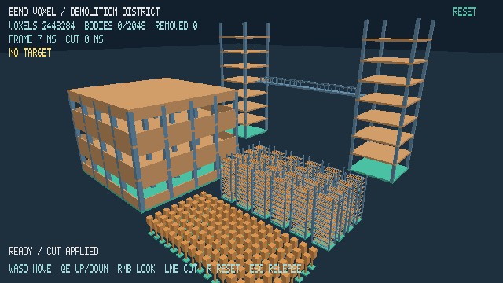
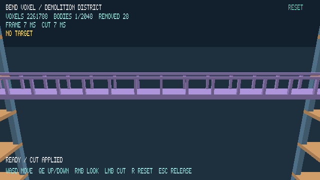

# Demolition district validation

The optional district scene has 2,443,284 occupied cells and supports one, four, or sixteen districts. The world, input, picking, timed-edit, and native body-cache checks are part of `make test`. Coverage includes dense occupancy and meshing, signed coordinates, elevated anchors, cross-region severing, atomic budget rollback, moving fragments, and 512 independent bodies. Invalid district configuration is rejected before opening a window.

The storage and cache trade-offs are recorded in [ADR 0001](../../adr/0001-sparse-cuboid-world.md). Vertical gravity and ground stopping are the implemented motion model; collision, rotation, and stacking remain outside this milestone. For fresh scale measurements, use the [stress benchmark guide](../../stress-benchmark.md).
