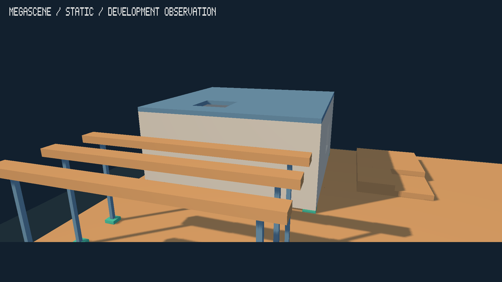

# Issue #49 static development evidence

Observed on 2026-09-28 using an AMD Ryzen 5 1600, NVIDIA GeForce GTX 1660,
NVIDIA driver 615.71.09, Linux/X11 and Bend 2.0.32. These are **unqualified
development observations**, not benchmark passes, endpoints or a completed
Megascene acceptance campaign.

## Public invocation

```sh
python3 scripts/megascene.py --case static --preset small --seed 45 \
  --threads 6 --resolution 1920x1080 --profile full \
  --output build/megascene/issue49/static/small-45 \
  --archive /home/aivv/megascene-evidence --capture-opening
```

The process completed the startup frame, all 120 warm-up frames and all 3,600
measured frames, then exited normally. Its initial inventory matched the
independent reference: 10,503,360 cells and 21 anchored owners. The actual
presentation mode was immediate; rendering used full meshes, a fixed [-40,40] m
ground and 2048-square world-fitted shadows. Five bodies were visible in the
opening view. All 21 full meshes remained resident, and all 21 participated in
the initial shadow pass. One proxy group and 144 proxy vertices were retained,
with zero proxy draws.

Cold startup was 294,536,421 ns. The measured population contained 3,600 ordinary
frames over 2,181,409,464 ns, with descriptive mean/p95/p99/max of approximately
0.606/0.895/1.295/4.119 ms. The schedule was not extended. Because it finished
in less than ten measured seconds, its timing population is insufficient.
Full validation, required checkpoints, resource qualification, GPU timing and
calibration remain unavailable. No performance or capacity claim follows.

## Opening capture



A separate fresh process produced the original 1920x1080 PPM. The PNG here is a
lossless format conversion. In this opening-only review, the building mass and
roof opening are visible; three separate span beams, their slender supports,
and the major shadows on terrain are visible. The closest beam extends outside
the frame under the accepted opening pose. The fitted shadow extents are about
116.232 by 90.006 m, corresponding to 0.05675 by 0.04395 m per texel. Shadow
edges show the expected finite-map resolution. This review does not establish
interior, cavity, far-view or whole-suite visual qualification.

The [summary](summary.json), [manifest](manifest.json),
[inventory](inventory.json) and [capture association](review.json) are copies
of observed evidence. Artifact paths inside these copied snapshots are relative
to the original attempt archive, **not this documentation directory**. The
complete retrievable bundle, including executable, application native library,
shaders, frozen inputs, CPU JSONL and capture, is at:

```text
/home/aivv/megascene-evidence/b6a682a0-7c5a-4e9b-a2d9-6204a7f9eae1/b3ed585f-fb96-40fa-a636-87c62344dadb/35d2bb4e-e828-45d0-81fc-9fa8119ea587/
```

Every manifest artifact/evidence hash was checked against that archive after
execution. The committed snapshots and screenshot supplement the archive;
they are not a self-contained reproduction bundle. The final reader also
rechecked the retained full schedule after report-validation tightening.

## Regression checks

- `bend PROOF.bend` and `bend PROOF.bend --verdict`: `ALL PROOFS CHECK`.
- `bash scripts/test.sh`: existing Bend runtime/reference suites, native geometry
  checks and Python suites passed. Unsafe/native behavior is runtime evidence.
- Static native fixtures: visible full meshes with unchanged retained proxies,
  fixed ground, identical shadow fitting, immediate priority, mailbox fallback
  and rejection when only FIFO is available.
- Static synthetic reports: strict sequence/schema/identity and interval checks,
  changed/missing render settings/state/work, duplicate completion, damaged tails,
  abnormal prefixes, wide clocks and no qualification from a completed prefix.
- Opt-in real Vulkan test: public short invocation and opening capture, archived
  artifact hashes, recovery at a different path using archived executable/library/
  shaders, and a controlled unavailable-display failure with retained evidence.
- All five unchanged Light Atelier cases passed at both 640x360 and 1920x1080,
  using their default 30 warm-up and 180 measured frames. Their report semantics,
  including detached-fragment `max_bodies`, remain unchanged.
- The six-cut face diagnostic passed its production/reference surface checks.

The [regression summary](regressions.json) records the observed legacy results.
Their full reports/raw output and test logs are also retained under
`/home/aivv/megascene-evidence/issue49-regressions/`. No unrestricted scale
campaign or implementation optimization was attempted.
